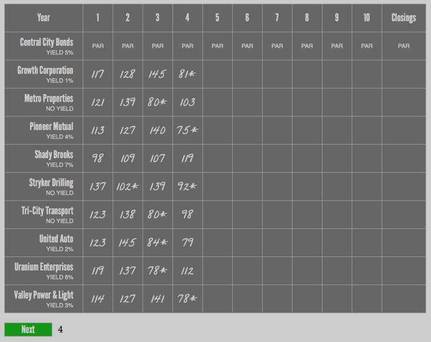

Stocks & Bonds
==============

A digital re-creation of the [3M board game from 1964](http://www.boardgamegeek.com/boardgame/1590/stocks-bonds) (with the exception of no event cards).

**[Try it out here!](http://mproud.com/stocksandbonds/)**

## How this works

Click the `Next` button to “roll” the dice. The number next to the button indicates your die roll. The table then gets updated with the changes in the stock market for each commodity, for that year.

If an event card comes up that changes a price, simply click in the cell and edit the price manually.

If a stock price eclipses 150 points, the stock will automatically split. An asterisk denotes a stock split, at the new price.

As always, follow the rules as in the board game.

## License

### League Gothic

Copyright (c) 2010, Caroline Hadilaksono & Micah Rich <caroline@hadilaksono, micah@micahrich.com>, with Reserved Font Name: "League Gothic".

This Font Software is licensed under the SIL Open Font License, Version 1.1.
This license is included in the project, and is also available at:
http://scripts.sil.org/OFL

Version 1.1 - 26 February 2007

### Other Files
All other files here are licensed under MIT, with one additional clause. http://www.opensource.org/licenses/MIT

Redistributions may not be sold, nor may they be used in a commercial product or activity. This is written as a companion aid to the real product. Please use this only for personal use.

The original Stocks & Bonds © 1964-1978 Avalon Hill

Copyright © 2014 ancestral

Permission is hereby granted, free of charge, to any person obtaining a copy of this software and associated documentation files (the "Software"), to deal in the Software without restriction, including without limitation the rights to use, copy, modify, merge, publish, distribute, sublicense, and/or sell copies of the Software, and to permit persons to whom the Software is furnished to do so, subject to the following conditions:

The above copyright notice and this permission notice shall be included in all copies or substantial portions of the Software.

THE SOFTWARE IS PROVIDED "AS IS", WITHOUT WARRANTY OF ANY KIND, EXPRESS OR IMPLIED, INCLUDING BUT NOT LIMITED TO THE WARRANTIES OF MERCHANTABILITY, FITNESS FOR A PARTICULAR PURPOSE AND NONINFRINGEMENT. IN NO EVENT SHALL THE AUTHORS OR COPYRIGHT HOLDERS BE LIABLE FOR ANY CLAIM, DAMAGES OR OTHER LIABILITY, WHETHER IN AN ACTION OF CONTRACT, TORT OR OTHERWISE, ARISING FROM, OUT OF OR IN CONNECTION WITH THE SOFTWARE OR THE USE OR OTHER DEALINGS IN THE SOFTWARE.
